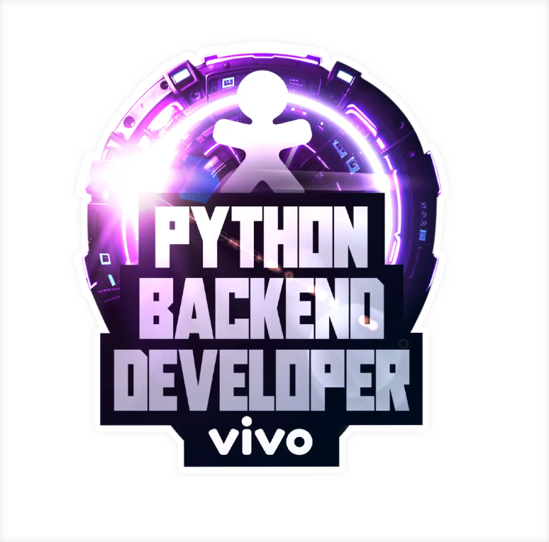

# Bootcamp Python Backend Developer DIO

No Bootcamp Python Backend Developer patrocinado pela VIVO e realizado em abril de 2024 foram abordados os seguintes assuntos:

- GIT
- Banco de dados relacionais
- Banco de dados não relacionais
- Python
- Criação de API e testes unitários
- Inteligência Artificial

Neste repositório estão disponíveis os materiais de estudos do curso.
